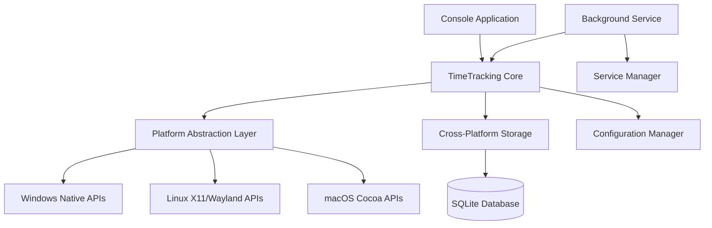

# Cross-Platform Time Tracking Design Document

## Overview

This design document outlines the architecture for transforming the existing Windows-specific time tracking plugin into a cross-platform solution that supports console operation and background service deployment. The solution will maintain compatibility with the existing data model while introducing platform abstraction layers and service management capabilities.

## Architecture

### High-Level Architecture



### Component Layers

1. **Application Layer**: Console application and background service entry points
2. **Core Layer**: Business logic for time tracking, data processing, and scheduling
3. **Platform Abstraction Layer**: OS-specific implementations for window monitoring
4. **Storage Layer**: Cross-platform database operations and data persistence
5. **Configuration Layer**: Platform-appropriate configuration management
6. **Service Management Layer**: OS-specific service installation and management

## Components and Interfaces

### 1. TimeTracking Core (`SoluiNet.DevTools.Core.TimeTracking`)

**Purpose**: Central business logic for time tracking operations

**Key Classes**:
- `CrossPlatformTimeTracker`: Main orchestrator for time tracking operations
- `WindowMonitor`: Manages periodic window monitoring and data collection
- `UsageDataProcessor`: Processes and categorizes usage data
- `TimeTrackingScheduler`: Handles background task scheduling using Quartz.NET

**Interfaces**:
```csharp
public interface ITimeTracker
{
    Task StartAsync(CancellationToken cancellationToken = default);
    Task StopAsync(CancellationToken cancellationToken = default);
    Task<bool> IsRunningAsync();
    event EventHandler<UsageDataEventArgs> UsageDataCaptured;
}

public interface IWindowMonitor
{
    Task<WindowInfo> GetActiveWindowAsync();
    Task StartMonitoringAsync(TimeSpan interval, CancellationToken cancellationToken = default);
    Task StopMonitoringAsync();
}
```

### 2. Platform Abstraction Layer (`SoluiNet.DevTools.Core.TimeTracking.Platform`)

**Purpose**: Provides consistent APIs across different operating systems

**Key Classes**:
- `WindowsPlatformProvider`: Windows-specific implementation using Win32 APIs
- `LinuxPlatformProvider`: Linux implementation using X11/Wayland
- `MacOSPlatformProvider`: macOS implementation using Cocoa APIs
- `PlatformProviderFactory`: Factory for creating platform-specific providers

**Interfaces**:
```csharp
public interface IPlatformProvider
{
    Task<WindowInfo> GetActiveWindowAsync();
    Task<ProcessInfo> GetActiveProcessAsync();
    bool IsSupported { get; }
    string PlatformName { get; }
}

public class WindowInfo
{
    public string Title { get; set; }
    public string ProcessName { get; set; }
    public int ProcessId { get; set; }
    public DateTime CapturedAt { get; set; }
}
```

### 3. Cross-Platform Storage (`SoluiNet.DevTools.Core.TimeTracking.Storage`)

**Purpose**: Manages data persistence across platforms with advanced querying capabilities

**Key Classes**:
- `CrossPlatformTimeTrackingContext`: Enhanced DbContext with platform-specific optimizations
- `StoragePathProvider`: Determines appropriate storage locations per platform
- `DatabaseMigrationService`: Handles schema migrations and upgrades
- `QueryRepository`: Advanced querying with regex and pattern matching support
- `TimeRangeQueryService`: Specialized service for time-based filtering

**Enhanced Context**:
```csharp
public class CrossPlatformTimeTrackingContext : DbContext
{
    public CrossPlatformTimeTrackingContext(string connectionString = null)
    {
        // Platform-specific initialization
    }
    
    protected override void OnConfiguring(DbContextOptionsBuilder optionsBuilder)
    {
        // Configure SQLite with platform-specific optimizations
        // Enable regex support for SQLite
    }
}

public class QueryRepository
{
    public async Task<IEnumerable<UsageTime>> QueryWithRegexAsync(string pattern, QueryField field)
    {
        // Use SQLite REGEXP function for pattern matching
    }
    
    public async Task<IEnumerable<UsageTime>> QueryWithLikeAsync(string pattern, QueryField field)
    {
        // Use SQLite LIKE operator with wildcards
    }
    
    public async Task<IEnumerable<UsageTime>> QueryTimeRangeAsync(DateTime date, TimeSpan? fromTime, TimeSpan? toTime)
    {
        // Filter by specific time ranges within dates
    }
    
    public async Task<IEnumerable<UsageTime>> ExecuteSqlQueryAsync(string sqlQuery)
    {
        // Execute validated SQL queries with safety checks
        // Support SELECT operations on UsageTime, Application, Category tables
    }
}

public class LimitedSqlQueryProcessor : ILimitedSqlQueryProcessor
{
    private readonly HashSet<string> _allowedTables = new() { "UsageTime", "Application", "Category", "ApplicationArea" };
    private readonly HashSet<string> _allowedOperations = new() { "SELECT" };
    private readonly HashSet<string> _allowedFunctions = new() { "COUNT", "SUM", "AVG", "MIN", "MAX", "DATE", "TIME", "STRFTIME" };
    private readonly HashSet<string> _forbiddenKeywords = new() { "DROP", "DELETE", "UPDATE", "INSERT", "ALTER", "CREATE", "EXEC", "EXECUTE" };
    
    public bool IsValidQuery(string sqlQuery)
    {
        // Parse and validate limited SQL syntax
        // Check for allowed operations and tables only
    }
    
    public bool IsSafeQuery(string sqlQuery)
    {
        // Ensure only read operations on time tracking tables
        // Validate against injection patterns
    }
    
    public string ParseAndValidateQuery(string sqlQuery)
    {
        // Convert limited SQL to safe parameterized query
    }
}
```

### 4. Console Application (`SoluiNet.DevTools.Console.TimeTracking`)

**Purpose**: Command-line interface for time tracking operations

**Key Features**:
- Command parsing using System.CommandLine
- Real-time monitoring display
- Data export capabilities with advanced filtering
- Regex and LIKE pattern matching for queries
- Time-based filtering (specific time ranges within dates)
- Limited SQL-like query language support for safe database querying
- Service management commands

**Query and Filtering Capabilities**:
```csharp
public class QueryOptions
{
    public DateTime? FromDate { get; set; }
    public DateTime? ToDate { get; set; }
    public TimeSpan? FromTime { get; set; }
    public TimeSpan? ToTime { get; set; }
    public string ApplicationRegex { get; set; }
    public string TitleRegex { get; set; }
    public string LikePattern { get; set; }
    public string FilterExpression { get; set; }
    public string SqlQuery { get; set; }
    public ExportFormat Format { get; set; }
}

public interface IQueryService
{
    Task<IEnumerable<UsageTime>> QueryAsync(QueryOptions options);
    Task<IEnumerable<UsageTime>> QueryWithRegexAsync(string pattern, QueryField field);
    Task<IEnumerable<UsageTime>> QueryWithLikeAsync(string pattern, QueryField field);
    Task<IEnumerable<UsageTime>> QueryTimeRangeAsync(DateTime date, TimeSpan fromTime, TimeSpan toTime);
    Task<IEnumerable<UsageTime>> QueryWithSqlAsync(string sqlQuery);
}

public interface ILimitedSqlQueryProcessor
{
    bool IsValidQuery(string sqlQuery);
    bool IsSafeQuery(string sqlQuery); // Prevents destructive operations
    string ParseAndValidateQuery(string sqlQuery);
    QueryResult ExecuteQuery(string sqlQuery);
}

public class LimitedSqlLanguage
{
    // Supported operations: SELECT, WHERE, GROUP BY, ORDER BY, LIMIT
    // Supported functions: COUNT, SUM, AVG, MIN, MAX, DATE functions
    // Supported tables: UsageTime, Application, Category, ApplicationArea
    // Forbidden: INSERT, UPDATE, DELETE, DROP, CREATE, ALTER
}
```

**Command Structure**:
```
timetracking start [--interval <seconds>] [--config <path>]
timetracking stop
timetracking status
timetracking query [--from <date>] [--to <date>] [--from-time <time>] [--to-time <time>] [--app <regex>] [--title <regex>] [--like <pattern>] [--format <json|csv>]
timetracking query --sql "<sql-query>" [--format <json|csv>]
timetracking export [--output <path>] [--format <json|csv>] [--filter <expression>]
timetracking service install [--auto-start]
timetracking service uninstall
timetracking service start
timetracking service stop
```

### 5. Background Service (`SoluiNet.DevTools.Service.TimeTracking`)

**Purpose**: System service/daemon for continuous time tracking

**Key Classes**:
- `TimeTrackingService`: Main service implementation
- `ServiceInstaller`: Platform-specific service installation
- `ServiceConfiguration`: Service-specific configuration management

**Service Lifecycle**:
```csharp
public class TimeTrackingService : BackgroundService
{
    protected override async Task ExecuteAsync(CancellationToken stoppingToken)
    {
        // Initialize time tracking
        // Start monitoring loop
        // Handle graceful shutdown
    }
}
```

### 6. Service Management (`SoluiNet.DevTools.Core.TimeTracking.ServiceManagement`)

**Purpose**: Platform-specific service installation and management

**Key Classes**:
- `WindowsServiceManager`: Windows Service Control Manager integration
- `LinuxServiceManager`: systemd service management
- `MacOSServiceManager`: launchd service management
- `ServiceManagerFactory`: Factory for platform-specific managers

## Data Models

### Enhanced Usage Data Model

The existing data model will be extended to support cross-platform scenarios:

```csharp
public class UsageTime
{
    // Existing properties...
    public string Platform { get; set; }
    public string ProcessPath { get; set; }
    public string WindowClass { get; set; }
    public Dictionary<string, object> PlatformSpecificData { get; set; }
}

public class SystemInfo
{
    public int SystemInfoId { get; set; }
    public string Platform { get; set; }
    public string Version { get; set; }
    public string Architecture { get; set; }
    public DateTime RecordedAt { get; set; }
}

public enum QueryField
{
    ApplicationIdentification,
    WindowTitle,
    ProcessName,
    ProcessPath,
    Platform,
    All
}

public enum ExportFormat
{
    Json,
    Csv,
    Xml
}
```

### Configuration Model

```csharp
public class TimeTrackingConfiguration
{
    public int MonitoringIntervalSeconds { get; set; } = 10;
    public string DatabasePath { get; set; }
    public LogLevel LogLevel { get; set; } = LogLevel.Information;
    public bool EnableAutoStart { get; set; } = false;
    public Dictionary<string, string> PlatformSpecificSettings { get; set; }
}
```

## Error Handling

### Exception Hierarchy

```csharp
public class TimeTrackingException : Exception
{
    public TimeTrackingException(string message) : base(message) { }
    public TimeTrackingException(string message, Exception innerException) : base(message, innerException) { }
}

public class PlatformNotSupportedException : TimeTrackingException
{
    public string PlatformName { get; }
    public PlatformNotSupportedException(string platformName) 
        : base($"Platform '{platformName}' is not supported for time tracking")
    {
        PlatformName = platformName;
    }
}

public class ServiceInstallationException : TimeTrackingException
{
    public ServiceInstallationException(string message, Exception innerException) 
        : base(message, innerException) { }
}
```

### Error Recovery Strategies

1. **Platform Detection Failure**: Fall back to basic process monitoring
2. **Database Connection Issues**: Implement retry logic with exponential backoff
3. **Service Installation Failure**: Provide detailed error messages and manual installation instructions
4. **Window API Failures**: Continue monitoring with reduced functionality

## Testing Strategy

### Unit Testing

1. **Platform Abstraction Layer**: Mock platform-specific APIs for consistent testing
2. **Core Logic**: Test time tracking algorithms and data processing
3. **Configuration Management**: Validate configuration loading and validation
4. **Database Operations**: Test CRUD operations and migrations

### Integration Testing

1. **Cross-Platform Compatibility**: Test on Windows, Linux, and macOS
2. **Service Installation**: Verify service installation and management on each platform
3. **Database Migrations**: Test upgrade paths from existing data
4. **Console Commands**: Validate all CLI operations

### Performance Testing

1. **Memory Usage**: Ensure memory consumption stays below 50MB
2. **CPU Usage**: Verify CPU usage remains under 1% during normal operation
3. **Database Performance**: Test with large datasets (1M+ records)
4. **Startup Time**: Measure service startup and initialization time

### Platform-Specific Testing

#### Windows Testing
- Windows Service integration
- Win32 API compatibility
- Windows-specific file paths and registry access

#### Linux Testing
- systemd service integration
- X11 and Wayland compatibility
- Linux file system permissions and paths

#### macOS Testing
- launchd service integration
- Cocoa API compatibility
- macOS security and permission requirements

### Limited SQL Query Language

The system will support a restricted SQL-like language for safe data querying:

**Allowed Operations:**
- SELECT (with column selection, wildcards)
- WHERE (with comparison operators, LIKE, BETWEEN)
- GROUP BY, ORDER BY, LIMIT
- Aggregate functions: COUNT, SUM, AVG, MIN, MAX
- Date/time functions: DATE, TIME, STRFTIME

**Allowed Tables:**
- UsageTime, Application, Category, ApplicationArea

**Query Examples:**
```sql
-- Get total time per application for the last week
SELECT ApplicationIdentification, SUM(Duration) as TotalSeconds 
FROM UsageTime 
WHERE StartTime >= date('now', '-7 days') 
GROUP BY ApplicationIdentification 
ORDER BY TotalSeconds DESC;

-- Find all Visual Studio sessions longer than 2 hours
SELECT * FROM UsageTime 
WHERE ApplicationIdentification LIKE '%Visual Studio%' 
AND Duration > 7200;

-- Get productivity patterns by hour of day
SELECT strftime('%H', StartTime) as Hour, 
       COUNT(*) as Sessions, 
       AVG(Duration) as AvgDuration 
FROM UsageTime 
GROUP BY Hour 
ORDER BY Hour;
```

**Forbidden Operations:**
- INSERT, UPDATE, DELETE, DROP, CREATE, ALTER
- EXEC, EXECUTE, or any stored procedure calls
- Subqueries or JOINs with external data sources

## Security Considerations

### Data Protection
- Encrypt sensitive window titles in database
- Implement secure configuration file handling
- Protect against SQL injection in queries through validation and parameterization

### Service Security
- Run service with minimal required privileges
- Implement secure inter-process communication
- Validate all external inputs and commands

### Platform Security
- Handle platform-specific security requirements
- Implement proper permission requests on macOS
- Respect Linux security contexts and SELinux policies

### Limited SQL Query Security
- Restrict to SELECT operations on predefined time tracking tables only
- Parse and validate queries using custom SQL parser with strict whitelist
- Implement query timeout (30 seconds) and result size limits (10,000 rows)
- Log all SQL queries for audit purposes
- Prevent nested queries and external data access

## Performance Optimizations

### Database Optimizations
- Implement connection pooling
- Use prepared statements for frequent queries
- Implement data archiving for old records
- Optimize indexes for common query patterns

### Memory Management
- Implement object pooling for frequent allocations
- Use efficient data structures for in-memory operations
- Implement proper disposal patterns for resources

### Monitoring Efficiency
- Implement smart monitoring that reduces frequency when no changes occur
- Cache window information to avoid redundant API calls
- Use efficient change detection algorithms

## Deployment Considerations

### Package Distribution
- Create platform-specific installers (MSI for Windows, DEB/RPM for Linux, PKG for macOS)
- Implement automatic update mechanisms
- Provide portable/standalone deployment options

### Configuration Management
- Support environment variable configuration
- Implement configuration validation and migration
- Provide configuration templates for common scenarios

### Monitoring and Diagnostics
- Implement comprehensive logging with configurable levels
- Provide health check endpoints for service monitoring
- Include diagnostic tools for troubleshooting