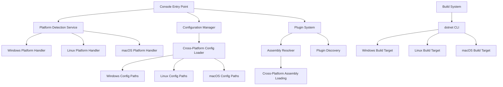
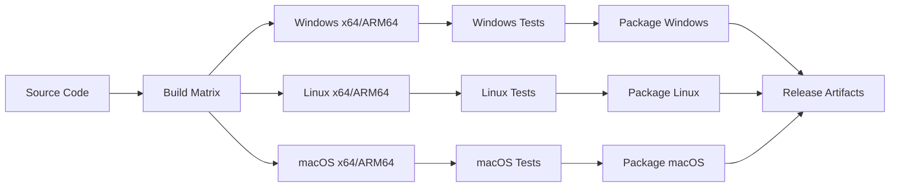

# Design Document

## Overview

This design transforms the SoluiNet.DevTools.Console application from a Windows-focused .NET 7.0 application to a fully cross-platform .NET 8.0 application. The design addresses platform-specific dependencies, build processes, file system operations, and deployment strategies while maintaining backward compatibility with existing plugins.

## Architecture

### High-Level Architecture



### Platform Abstraction Layer

The design introduces a platform abstraction layer that encapsulates platform-specific operations:

- **IPlatformService**: Interface defining platform-specific operations
- **WindowsPlatformService**: Windows-specific implementations
- **LinuxPlatformService**: Linux-specific implementations
- **MacOSPlatformService**: macOS-specific implementations

## Components and Interfaces

### 1. Platform Detection and Services

#### IPlatformService Interface
```csharp
public interface IPlatformService
{
    string GetConfigurationDirectory();
    string GetApplicationDataDirectory();
    string GetTempDirectory();
    string NormalizePath(string path);
    bool IsExecutableFile(string filePath);
    string GetExecutableExtension();
}

// Factory using built-in platform detection
public static class PlatformServiceFactory
{
    public static IPlatformService Create()
    {
        if (OperatingSystem.IsWindows()) return new WindowsPlatformService();
        if (OperatingSystem.IsLinux()) return new LinuxPlatformService();
        if (OperatingSystem.IsMacOS()) return new MacOSPlatformService();
        throw new PlatformNotSupportedException();
    }
}
```

#### Platform-Specific Implementations
- **WindowsPlatformService**: Handles Windows-specific paths, registry access, and file operations
- **LinuxPlatformService**: Manages Linux filesystem conventions and permissions
- **MacOSPlatformService**: Implements macOS bundle and application directory conventions

### 2. Enhanced Configuration System

#### IConfigurationManager Interface
```csharp
public interface IConfigurationManager
{
    T GetConfiguration<T>(string configurationName) where T : class;
    void SaveConfiguration<T>(string configurationName, T configuration) where T : class;
    string GetConfigurationPath(string configurationName);
    bool ConfigurationExists(string configurationName);
}
```

#### Cross-Platform Configuration Paths
- **Windows**: `%APPDATA%\SoluiNet\DevTools`
- **Linux**: `~/.config/soluinet-devtools`
- **macOS**: `~/Library/Application Support/SoluiNet.DevTools`

### 3. Enhanced Plugin System

#### Cross-Platform Assembly Loading
```csharp
public class CrossPlatformAssemblyResolver
{
    public Assembly ResolveAssembly(string assemblyName, string[] searchPaths);
    public IEnumerable<string> GetPluginSearchPaths();
    public bool IsCompatibleAssembly(string assemblyPath);
}
```

#### Plugin Discovery Enhancement
- Platform-agnostic plugin discovery using `Directory.EnumerateFiles`
- Support for both `.dll` and platform-specific extensions
- Enhanced error handling for assembly loading failures

### 4. Build System Modernization

#### dotnet CLI Integration
- Replace MSBuild-specific targets with dotnet CLI commands
- Support for Runtime Identifiers (RIDs): `win-x64`, `win-arm64`, `linux-x64`, `linux-arm64`, `osx-x64`, `osx-arm64`
- Self-contained deployment options for each platform and architecture
- Architecture-specific optimizations for ARM64 and x64 processors

#### Build Configuration
```xml
<PropertyGroup>
    <TargetFramework>net8.0</TargetFramework>
    <RuntimeIdentifiers>win-x64;win-arm64;linux-x64;linux-arm64;osx-x64;osx-arm64</RuntimeIdentifiers>
    <UseAppHost>true</UseAppHost>
    <PublishSingleFile>true</PublishSingleFile>
    <SelfContained>false</SelfContained>
</PropertyGroup>

<!-- Conditional compilation symbols for platform-specific code -->
<PropertyGroup Condition="'$(RuntimeIdentifier)' == 'win-x64' OR '$(RuntimeIdentifier)' == 'win-arm64'">
    <DefineConstants>$(DefineConstants);WINDOWS</DefineConstants>
</PropertyGroup>
<PropertyGroup Condition="'$(RuntimeIdentifier)' == 'linux-x64' OR '$(RuntimeIdentifier)' == 'linux-arm64'">
    <DefineConstants>$(DefineConstants);LINUX</DefineConstants>
</PropertyGroup>
<PropertyGroup Condition="'$(RuntimeIdentifier)' == 'osx-x64' OR '$(RuntimeIdentifier)' == 'osx-arm64'">
    <DefineConstants>$(DefineConstants);MACOS</DefineConstants>
</PropertyGroup>
```

## Data Models

### Platform Detection Using Built-in .NET APIs
```csharp
// Use built-in .NET platform detection instead of custom model
public static class PlatformHelper
{
    public static bool IsWindows => OperatingSystem.IsWindows();
    public static bool IsLinux => OperatingSystem.IsLinux();
    public static bool IsMacOS => OperatingSystem.IsMacOS();
    public static Architecture Architecture => RuntimeInformation.ProcessArchitecture;
    public static string RuntimeIdentifier => RuntimeInformation.RuntimeIdentifier;
    
    // Conditional compilation for platform-specific code
    #if WINDOWS
    // Windows-specific implementations
    #elif LINUX  
    // Linux-specific implementations
    #elif MACOS
    // macOS-specific implementations
    #endif
}
```

### Configuration Model Enhancement
```csharp
public class ApplicationConfiguration
{
    public string Version { get; set; }
    public Dictionary<string, bool> EnabledPlugins { get; set; }
    public LoggingConfiguration Logging { get; set; }
    // Platform-specific settings handled through conditional compilation and runtime detection
}
```

### Plugin Metadata Model
```csharp
public class PluginMetadata
{
    public string Name { get; set; }
    public string Version { get; set; }
    public string[] SupportedPlatforms { get; set; }
    public string[] Dependencies { get; set; }
    public bool RequiresElevation { get; set; }
}
```

## Error Handling

### Platform-Specific Error Handling
- **Cross-Platform Exception Wrapper**: Standardizes platform-specific exceptions
- **Graceful Degradation**: Disable platform-specific features when not available
- **Enhanced Logging**: Platform-aware logging with appropriate log file locations

### Error Recovery Strategies
1. **Plugin Loading Failures**: Continue operation with remaining plugins
2. **Configuration Access Issues**: Fall back to default configurations
3. **Platform Detection Failures**: Default to generic cross-platform behavior
4. **Assembly Resolution Failures**: Provide detailed diagnostic information

## Testing Strategy

### Unit Testing Approach
- **Platform Abstraction Testing**: Mock platform services for isolated testing
- **Configuration Testing**: Test configuration loading/saving across platforms
- **Plugin System Testing**: Verify plugin discovery and loading mechanisms
- **Build System Testing**: Validate build outputs for each target platform

### Integration Testing
- **Cross-Platform Integration Tests**: Run on Windows, Linux, and macOS
- **Plugin Compatibility Tests**: Verify existing plugins work with new system
- **Configuration Migration Tests**: Ensure smooth upgrade from existing installations
- **End-to-End Workflow Tests**: Complete application lifecycle testing

### Platform-Specific Testing
- **Windows Testing**: Test on Windows 10/11 x64 and ARM64 (Surface Pro X) with various .NET installations
- **Linux Testing**: Test on Ubuntu, CentOS, and Alpine Linux distributions for both x64 and ARM64 (Raspberry Pi, ARM servers)
- **macOS Testing**: Test on Intel Macs (x64) and Apple Silicon Macs (ARM64)

### Automated Testing Pipeline


## Migration Strategy

### Backward Compatibility
- **Configuration Migration**: Automatic migration of existing Windows configurations
- **Plugin Compatibility**: Support for plugins built against previous .NET versions
- **Command-Line Compatibility**: Maintain existing command-line interface

### Upgrade Process
1. **Detect Existing Installation**: Identify current version and configuration
2. **Backup Configuration**: Create backup of existing settings
3. **Migrate Settings**: Convert platform-specific paths and configurations
4. **Validate Migration**: Ensure all plugins and configurations work correctly
5. **Cleanup Legacy Files**: Remove obsolete platform-specific files

## Performance Considerations

### Startup Performance
- **Lazy Plugin Loading**: Load plugins on-demand rather than at startup
- **Cached Assembly Resolution**: Cache assembly locations for faster subsequent loads
- **Optimized Platform Detection**: Cache platform information after first detection

### Runtime Performance
- **Platform-Specific Optimizations**: Use platform-native APIs where beneficial
- **Architecture-Specific Optimizations**: Leverage ARM64 SIMD instructions where available
- **Memory Management**: Efficient plugin lifecycle management with architecture-aware allocation
- **I/O Optimization**: Platform-appropriate file system operations

### ARM64-Specific Considerations
- **Native ARM64 Compilation**: Ensure plugins are compatible with ARM64 architecture
- **Performance Profiling**: Validate performance characteristics on ARM64 vs x64
- **Memory Efficiency**: Optimize for ARM64 memory access patterns
- **Cross-Architecture Plugin Loading**: Handle mixed x64/ARM64 plugin scenarios gracefully

## Security Considerations

### Cross-Platform Security
- **Assembly Verification**: Verify plugin assemblies before loading
- **Sandboxed Plugin Execution**: Isolate plugin execution where possible
- **Secure Configuration Storage**: Platform-appropriate secure storage for sensitive settings
- **Permission Management**: Handle platform-specific permission requirements

### Platform-Specific Security
- **Windows**: Code signing for executables and installers
- **Linux**: Package signing for distribution packages
- **macOS**: Notarization for App Store and Gatekeeper compatibility