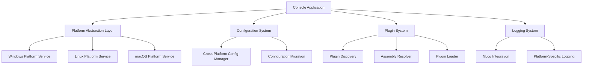

# SoluiNet.DevTools.Console Documentation

Welcome to the comprehensive documentation for SoluiNet.DevTools.Console, a cross-platform developer tools application built on .NET 8.0.

## Overview

SoluiNet.DevTools.Console is a powerful, extensible command-line application that provides developers with a unified set of tools across Windows, Linux, and macOS platforms. Built with modern .NET 8.0 and designed for cross-platform compatibility, it offers a plugin-based architecture that allows for easy extension and customization.

### Key Features

- **Cross-Platform Compatibility**: Runs natively on Windows, Linux, and macOS
- **Multi-Architecture Support**: Supports both x64 and ARM64 architectures
- **Plugin System**: Extensible architecture with dynamic plugin loading
- **Modern .NET 8.0**: Built on the latest .NET platform for optimal performance
- **Command-Line Interface**: Powerful CLI with comprehensive help and diagnostics
- **Configuration Management**: Flexible, platform-aware configuration system
- **Comprehensive Logging**: Advanced logging with platform-specific integrations

### Supported Platforms

| Platform | x64 | ARM64 | Notes |
|----------|-----|-------|-------|
| Windows 10/11 | ✅ | ✅ | Full support including Windows-specific features |
| Linux (Ubuntu, RHEL, etc.) | ✅ | ✅ | Supports major distributions |
| macOS 10.15+ | ✅ | ✅ | Intel and Apple Silicon support |

## Quick Start

### Installation

Choose your preferred installation method:

**Windows (Chocolatey):**
```powershell
choco install soluinet-devtools-console
```

**Linux (APT):**
```bash
sudo apt install soluinet-devtools-console
```

**macOS (Homebrew):**
```bash
brew install soluinet/devtools/soluinet-devtools-console
```

**Manual Installation:**
Download the appropriate package for your platform from the [releases page](https://github.com/SoluiNet/SoluiNet.DevTools/releases).

### Basic Usage

```bash
# Check version and system information
sndt --version

# Display help
sndt --help

# List available plugins
sndt plugin list

# Run diagnostics
sndt diagnostics
```

## Documentation Structure

### Getting Started
- **[Installation Guide](INSTALLATION.md)** - Platform-specific installation instructions
- **[Configuration Guide](CONFIGURATION.md)** - Configure the application for your needs
- **[Quick Start Tutorial](QUICKSTART.md)** - Get up and running in minutes

### Development and Building
- **[Build Guide](BUILD.md)** - Build from source using dotnet CLI
- **[Plugin Development Guide](PLUGIN_DEVELOPMENT.md)** - Create custom plugins
- **[API Reference](API_REFERENCE.md)** - Programming interfaces and APIs

### Deployment and Operations
- **[Deployment Guide](DEPLOYMENT.md)** - Deploy across different environments
- **[Troubleshooting Guide](TROUBLESHOOTING.md)** - Resolve common issues
- **[Performance Tuning](PERFORMANCE.md)** - Optimize for your use case

### Advanced Topics
- **[Security Guide](SECURITY.md)** - Security best practices and configuration
- **[Integration Guide](INTEGRATION.md)** - Integrate with other tools and systems
- **[Migration Guide](MIGRATION.md)** - Migrate from previous versions

## Architecture Overview



### Core Components

1. **Platform Abstraction Layer**: Handles platform-specific operations and file system conventions
2. **Configuration System**: Manages application and plugin settings with platform-aware paths
3. **Plugin System**: Discovers, loads, and manages plugins with cross-platform compatibility
4. **Logging System**: Provides comprehensive logging with platform-specific integrations
5. **Command-Line Interface**: Offers rich CLI experience with help, diagnostics, and interactive features

## Platform-Specific Features

### Windows
- Windows Service integration
- Registry configuration support
- Windows Event Log integration
- PowerShell script integration
- MSI installer support

### Linux
- Systemd service integration
- Syslog integration
- Package manager support (APT, YUM, DNF)
- Container deployment (Docker, Podman)
- Snap and Flatpak packaging

### macOS
- Launch daemon integration
- macOS unified logging (os_log)
- Homebrew and MacPorts support
- App bundle packaging
- Code signing and notarization

## Configuration Locations

The application stores configuration in platform-appropriate locations:

- **Windows**: `%APPDATA%\SoluiNet\DevTools\`
- **Linux**: `~/.config/soluinet-devtools/`
- **macOS**: `~/Library/Application Support/SoluiNet.DevTools/`

## Plugin System

### Available Plugins

| Plugin | Description | Platforms |
|--------|-------------|-----------|
| SqlPlugin.Example | Database connectivity and SQL tools | All |
| Utils.Json | JSON formatting and validation | All |
| Utils.Crypto | Cryptographic utilities | All |
| Utils.File | File manipulation tools | All |
| Communication.EMail | Email integration | All |
| SmartHome.* | Smart home device integration | All |

### Plugin Development

Create custom plugins using the plugin SDK:

```csharp
public class MyPlugin : IBasePlugin
{
    public string Name => "My Custom Plugin";
    public string Description => "Custom functionality";
    
    public void Initialize()
    {
        // Plugin initialization
    }
    
    public void Execute(string[] args)
    {
        // Plugin logic
    }
}
```

See the [Plugin Development Guide](PLUGIN_DEVELOPMENT.md) for detailed instructions.

## Command-Line Interface

### Basic Commands

```bash
# Application information
sndt --version              # Show version information
sndt --help                 # Display help
sndt info --system          # System information
sndt diagnostics            # Run diagnostics

# Configuration management
sndt config show            # Show current configuration
sndt config set key value   # Set configuration value
sndt config reset           # Reset to defaults

# Plugin management
sndt plugin list            # List available plugins
sndt plugin enable name     # Enable plugin
sndt plugin disable name    # Disable plugin
sndt plugin install file    # Install plugin from file
```

### Advanced Commands

```bash
# Performance and monitoring
sndt diagnostics --performance    # Performance diagnostics
sndt health --monitor            # Health monitoring
sndt maintenance --optimize      # Optimize performance

# Development and debugging
sndt --log-level Debug          # Enable debug logging
sndt plugin validate --all      # Validate all plugins
sndt config validate            # Validate configuration
```

## Environment Variables

Configure the application using environment variables:

| Variable | Description | Example |
|----------|-------------|---------|
| `SOLUINET_DEVTOOLS_CONFIG_DIR` | Override config directory | `/custom/config` |
| `SOLUINET_DEVTOOLS_LOG_LEVEL` | Set logging level | `Debug`, `Info`, `Warning` |
| `SOLUINET_DEVTOOLS_NO_TELEMETRY` | Disable telemetry | `true` |
| `SOLUINET_DEVTOOLS_OFFLINE` | Offline mode | `true` |

## Building from Source

### Prerequisites
- .NET 8.0 SDK
- Git

### Build Commands

```bash
# Clone repository
git clone https://github.com/SoluiNet/SoluiNet.DevTools.git
cd SoluiNet.DevTools

# Restore dependencies
dotnet restore

# Build for current platform
dotnet build SoluiNet.DevTools.Console/SoluiNet.DevTools.Console.csproj --configuration Release

# Build for specific platform
dotnet publish SoluiNet.DevTools.Console/SoluiNet.DevTools.Console.csproj \
  --configuration Release \
  --runtime linux-x64 \
  --output ./build/linux-x64

# Build all platforms
./scripts/build-all-platforms.sh --configuration Release
```

See the [Build Guide](BUILD.md) for comprehensive build instructions.

## Testing

### Running Tests

```bash
# Run all tests
dotnet test SoluiNet.DevTools.UnitTest/SoluiNet.DevTools.UnitTest.csproj

# Run with coverage
dotnet test --collect:"XPlat Code Coverage"

# Cross-platform testing
./scripts/test-all-platforms.sh
```

### Test Categories

- **Unit Tests**: Core functionality testing
- **Integration Tests**: Plugin and system integration
- **Cross-Platform Tests**: Platform-specific behavior validation
- **Performance Tests**: Performance and resource usage validation

## Contributing

We welcome contributions! Please see our [Contributing Guide](../CONTRIBUTING.md) for details on:

- Code style and standards
- Pull request process
- Issue reporting
- Development setup
- Testing requirements

### Development Setup

1. Fork the repository
2. Clone your fork
3. Install .NET 8.0 SDK
4. Run `dotnet restore`
5. Make your changes
6. Run tests: `dotnet test`
7. Submit a pull request

## Support and Community

### Getting Help

- **Documentation**: [https://docs.soluinet.com/devtools](https://docs.soluinet.com/devtools)
- **GitHub Issues**: [Report bugs and request features](https://github.com/SoluiNet/SoluiNet.DevTools/issues)
- **GitHub Discussions**: [Community discussions](https://github.com/SoluiNet/SoluiNet.DevTools/discussions)
- **Email Support**: [support@soluinet.com](mailto:support@soluinet.com)

### Community Resources

- **Wiki**: [Community-maintained documentation](https://github.com/SoluiNet/SoluiNet.DevTools/wiki)
- **Examples**: [Sample plugins and configurations](https://github.com/SoluiNet/SoluiNet.DevTools.Examples)
- **Blog**: [Development updates and tutorials](https://blog.soluinet.com/devtools)

## Roadmap

### Current Version (1.0.0)
- ✅ Cross-platform .NET 8.0 support
- ✅ Multi-architecture builds (x64, ARM64)
- ✅ Plugin system with cross-platform compatibility
- ✅ Comprehensive configuration system
- ✅ Advanced logging and diagnostics

### Upcoming Features (1.1.0)
- 🔄 Native AOT compilation support
- 🔄 Container-first deployment options
- 🔄 Enhanced plugin security and sandboxing
- 🔄 Built-in update mechanism
- 🔄 Performance monitoring and metrics

### Future Enhancements (2.0.0)
- 📋 Web-based management interface
- 📋 Distributed plugin repository
- 📋 Cloud-native integrations
- 📋 AI-powered development assistance
- 📋 Enhanced security features

## License

This project is licensed under the MIT License. See the [LICENSE](../LICENSE) file for details.

## Acknowledgments

- Built with [.NET 8.0](https://dotnet.microsoft.com/)
- Logging powered by [NLog](https://nlog-project.org/)
- Cross-platform compatibility enabled by [.NET Runtime](https://github.com/dotnet/runtime)
- Community contributions and feedback

---

**Last Updated**: October 27, 2025  
**Version**: 1.0.0  
**Supported Platforms**: Windows 10/11, Linux (Ubuntu 18.04+, RHEL 7+), macOS 10.15+  
**Architectures**: x64, ARM64